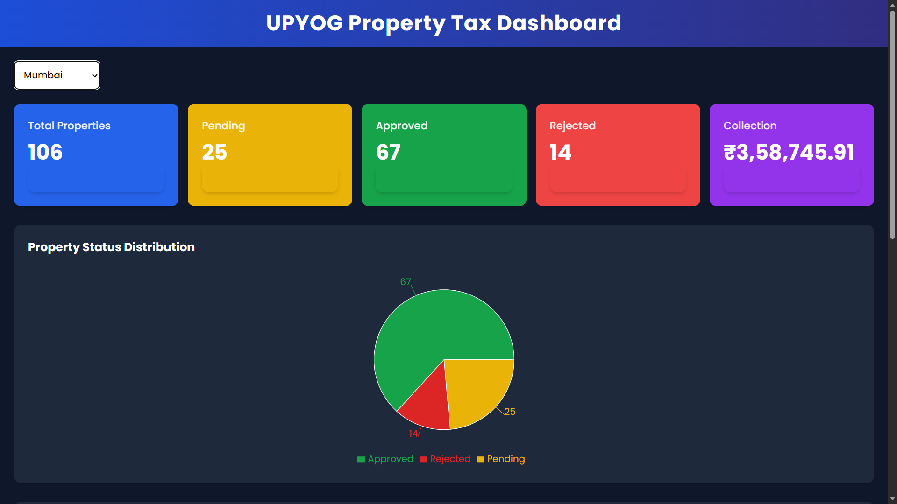
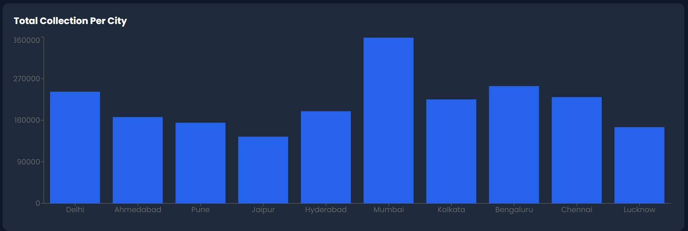
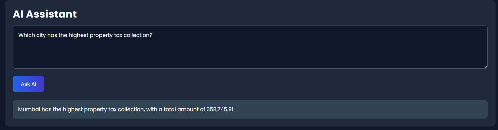

# 🏛️ UPYOG Property Tax Dashboard

A modern AI-powered analytics dashboard built using **React**, **Tailwind CSS**, **Recharts**, and **Gemini AI** for intelligent property tax analysis and visualization.

---

# 🚀 Features

✅ Dynamic KPI Cards  
✅ Tenant/City Filtering  
✅ Interactive Bar Chart  
✅ Property Status Pie Chart  
✅ Gemini AI Assistant  
✅ Responsive Dashboard UI  
✅ Modern Dark Analytics Theme  
✅ Real-time Property Insights  
✅ Smooth Animations & Hover Effects  

---

# 🧠 AI Assistant Capabilities

The integrated Gemini AI Assistant can answer questions like:

- 📌 Which city has the highest tax collection?
- 📌 Which city has the most approved properties?
- 📌 Compare Delhi and Mumbai collections
- 📌 Which city has the highest pending applications?
- 📌 Property approval statistics by city

---

# 🛠️ Tech Stack

| Technology | Usage |
|---|---|
| ⚛️ React.js | Frontend Framework |
| ⚡ Vite | Fast Development Environment |
| 🎨 Tailwind CSS | Styling |
| 📊 Recharts | Data Visualization |
| 🤖 Gemini AI API | AI Analytics Assistant |
| 🌐 Axios | API Requests |

---

# 📂 Project Structure

```bash
src/
│
├── components/
│   ├── Navbar.jsx
│   ├── KPISection.jsx
│   ├── KPICard.jsx
│   ├── TenantFilter.jsx
│   ├── Charts.jsx
│   ├── AIChat.jsx
│
├── properties.json
├── App.jsx
├── index.css
└── main.jsx
```

---

# 📸 Dashboard Screenshots

## 🖥️ Main Dashboard



---

## 📊 Analytics Charts



---

## 🤖 AI Assistant



---

# ⚙️ Installation & Setup

## 1️⃣ Clone Repository

```bash
git clone YOUR_GITHUB_REPO_LINK
```

---

## 2️⃣ Install Dependencies

```bash
npm install
```

---

## 3️⃣ Create Environment File

Create a `.env` file in the root directory:

```env
VITE_GEMINI_API_KEY=YOUR_API_KEY
```

---

## 4️⃣ Run Development Server

```bash
npm run dev
```

---

# 🌟 Dashboard Highlights

✨ Dynamic city-based analytics  
✨ Real-time KPI updates  
✨ Responsive charts and layout  
✨ AI-generated analytical insights  
✨ Modern SaaS-inspired UI design  

---

# 🔮 Future Improvements

- 📥 Export Reports
- 📱 Enhanced Mobile Experience
- 📈 More Advanced Analytics
- 🧾 Downloadable PDF Reports
- 💬 AI Chat History
- 🔐 Authentication System

---

# 👨‍💻 Author

### Lakshay Srivastava

Built as part of the **NUDM UPYOG Internship Assessment** 🚀

---

# ⭐ If you like this project, consider giving it a star on GitHub!